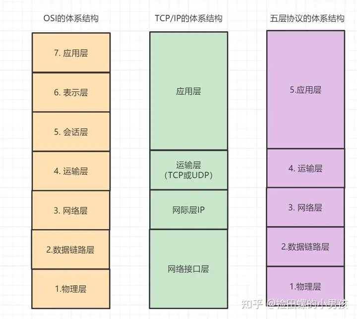
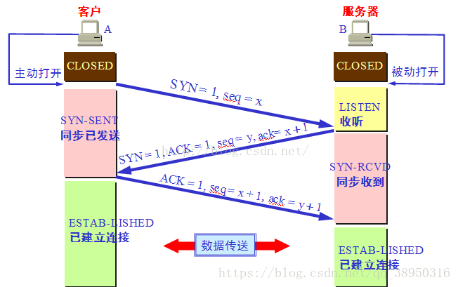
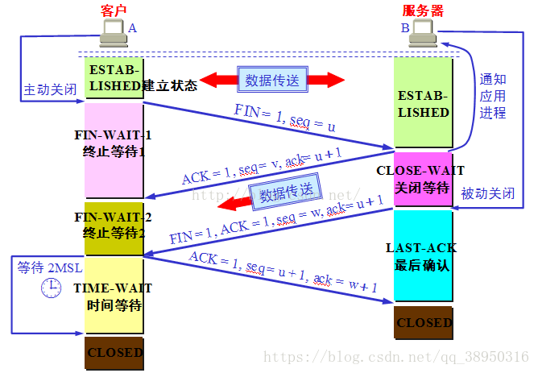
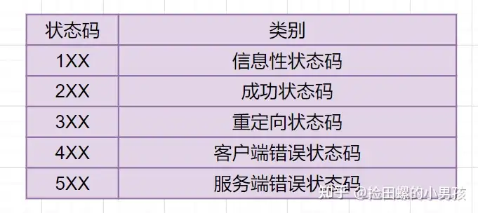
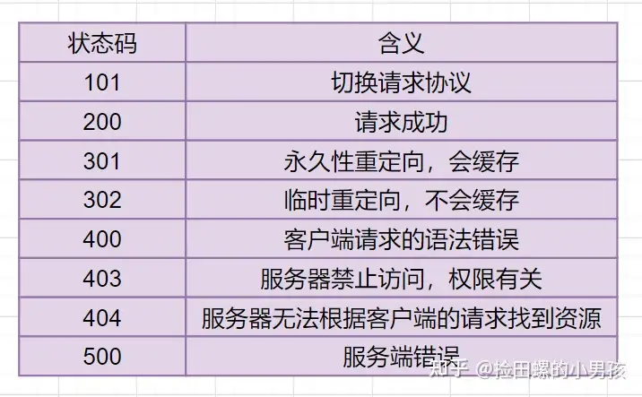

# 计算机网络

## 一、网络体系结构

### 1. OSI 七层模型

| 层级 | 名称 | 功能描述 | 典型协议 |
|------|------|----------|----------|
| 7 | 应用层 | 网络服务与最终用户的接口 | HTTP、FTP、SMTP、SNMP、DNS |
| 6 | 表示层 | 数据的表示、安全、压缩 | SSL/TLS |
| 5 | 会话层 | 建立、管理、终止会话 | NetBIOS、RPC |
| 4 | 传输层 | 定义传输数据的协议端口号，流控和差错校验 | TCP、UDP |
| 3 | 网络层 | 逻辑地址寻址，实现不同网络间的路径选择 | IP、ICMP、IGMP、ARP |
| 2 | 数据链路层 | 在物理层提供比特流服务的基础上，建立相邻结点间的数据链路 | PPP、Ethernet |
| 1 | 物理层 | 比特流的透明传输 | 光纤、双绞线 |

---

## 二、TCP 三次握手与四次挥手

### 1. TCP 标志位说明

| 标志位 | 名称 | 作用 |
|--------|------|------|
| **SYN** | 同步 | 连接建立时用于同步序号 |
| **ACK** | 确认 | 仅当 ACK=1 时，确认号字段有效 |
| **FIN** | 终止 | 用来释放一个连接 |
| seq | 序列号 | 标记数据段的顺序，占 4 字节 |
| ack | 确认号 | 期待收到对方下一个报文段的第一个数据字节的序号 |

> **注意**：ACK、SYN、FIN 是大写的标志位（值为 0 或 1）；ack、seq 是小写的序号。

### 2. 三次握手（建立连接）

**核心目的**：让客户端和服务端都能确认双方具备收发消息的能力。

**具体过程**：

初始状态：**客户端 CLOSED**，**服务端 LISTEN**

1. **第一次握手**：客户端发送 SYN 报文，指明客户端初始化序列号 **ISN(c)**，客户端进入 **SYN_SENT** 状态。

2. **第二次握手**：服务端收到 SYN 后，以自己的 SYN 作为应答，指定服务端初始化序列号 **ISN(s)**，同时将客户端 ISN + 1 作为 ACK 值，服务端进入 **SYN_RCVD** 状态。

3. **第三次握手**：客户端收到 SYN 后，发送 ACK 报文（服务端 ISN + 1），客户端进入 **ESTABLISHED** 状态；服务端收到 ACK 后也进入 **ESTABLISHED** 状态，连接建立完成。

#### 常见问题

**Q1：ISN 是固定的吗？**

不是。ISN（Initial Sequence Number）是动态生成的。如果固定，攻击者容易猜出后续确认号，存在安全隐患。

**Q2：什么是半连接队列？**

服务端第一次收到客户端 SYN 后，进入 SYN_RCVD 状态，此时连接未完全建立，会将这些请求放入**半连接队列**。已完成三次握手的连接放入**全连接队列**。队列满时可能出现丢包。

**Q3：三次握手可以携带数据吗？**

- 第一次、第二次握手：**不可以**携带数据
- 第三次握手：**可以**携带数据

### 3. 四次挥手（断开连接）

**核心特点**：TCP 连接是全双工的，每个方向都需要单独关闭。

**具体过程**（假设客户端主动发起关闭）：

初始状态：**双方 ESTABLISHED**

1. **第一次挥手**：客户端发送 FIN 报文，指定序列号，客户端进入 **FIN_WAIT_1** 状态。

2. **第二次挥手**：服务端收到 FIN 后，发送 ACK（客户端序列号 + 1），服务端进入 **CLOSE_WAIT** 状态；客户端收到 ACK 后进入 **FIN_WAIT_2** 状态。

3. **第三次挥手**：服务端数据发送完毕后，发送 FIN 报文，指定序列号，服务端进入 **LAST_ACK** 状态。

4. **第四次挥手**：客户端收到 FIN 后，发送 ACK（服务端序列号 + 1），客户端进入 **TIME_WAIT** 状态；服务端收到 ACK 后进入 **CLOSED** 状态。

#### 常见问题

**Q：为什么客户端发送最后一个 ACK 后不立即关闭？**

客户端需要等待 **2MSL**（Maximum Segment Lifetime，最大报文生存时间）才能进入 CLOSED 状态。

**原因**：
- 确保服务端收到了 ACK 报文
- 如果没收到，服务端会重传 FIN，客户端还能再次发送 ACK
- MSL 是数据包在网络中的最大生存时间，2MSL 是往返最大时间

---

## 三、从输入 URL 到页面显示的全过程

1. **DNS 解析**：查找域名对应的 IP 地址
2. **建立连接**：与服务器通过三次握手建立 TCP 连接
3. **发送请求**：向服务器发送 HTTP 请求
4. **处理响应**：服务器处理请求，返回网页内容
5. **渲染页面**：浏览器解析并渲染页面
6. **断开连接**：TCP 四次挥手，连接结束

---

## 四、HTTP 状态码

### 常见状态码分类

| 类别 | 范围 | 含义 |
|------|------|------|
| 1xx | 100-199 | 信息性状态码 |
| 2xx | 200-299 | 成功状态码 |
| 3xx | 300-399 | 重定向状态码 |
| 4xx | 400-499 | 客户端错误状态码 |
| 5xx | 500-599 | 服务器错误状态码 |

### 常用状态码

| 状态码 | 含义 | 说明 |
|--------|------|------|
| 200 | OK | 请求成功 |
| 301 | Moved Permanently | 永久重定向 |
| 302 | Found | 临时重定向 |
| 304 | Not Modified | 未修改，使用缓存 |
| 400 | Bad Request | 请求参数错误 |
| 401 | Unauthorized | 未授权 |
| 403 | Forbidden | 禁止访问 |
| 404 | Not Found | 资源不存在 |
| 500 | Internal Server Error | 服务器内部错误 |
| 502 | Bad Gateway | 网关错误 |
| 503 | Service Unavailable | 服务不可用 |
